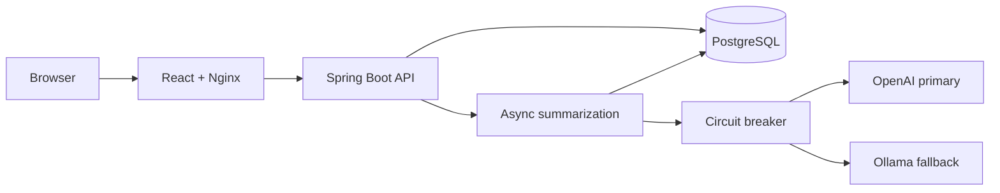

# BrieflyAI

BrieflyAI is a full-stack note application that saves notes immediately and generates concise AI summaries in the background.

It demonstrates a practical production-style flow: a fast user-facing API, asynchronous AI processing, provider fallback, PostgreSQL persistence, and containerized deployment.

## Features

- Create and view notes through a React UI
- Persist notes in PostgreSQL
- Generate summaries asynchronously so note creation returns quickly
- Use OpenAI as the primary provider
- Fall back to local Ollama when OpenAI is unavailable or rate-limited
- Prevent repeated failing OpenAI calls with a Resilience4j circuit breaker
- Run React, Spring Boot, and PostgreSQL together using Docker Compose

## Architecture



## Request Flow

```text
1. User creates a note in React.
2. Spring Boot saves it in PostgreSQL and returns immediately.
3. The UI shows “Generating summary…”.
4. A background task tries OpenAI.
5. If OpenAI fails or the circuit is open, it uses Ollama.
6. The generated summary is saved back to PostgreSQL.
7. React polls the API and updates the note automatically.
```

This is eventual consistency: the note is available immediately, while its AI summary appears shortly afterward.

## Tech Stack

| Area | Technology |
|---|---|
| Frontend | React, Vite |
| Backend | Java 21, Spring Boot 4 |
| Database | PostgreSQL |
| AI | Spring AI, OpenAI GPT-4o Mini, Ollama Qwen3 0.6B |
| Resilience | Resilience4j Circuit Breaker |
| Deployment | Docker, Docker Compose, Nginx |

## Run with Docker

### Prerequisites

- Docker Desktop
- Ollama running locally
- Qwen model downloaded:

```bash
ollama pull qwen3:0.6b
```

### Start the application

```bash
docker compose up --build
```

Open the application:

```text
http://localhost:3000
```

The services are:

| Service | Address |
|---|---|
| React UI | http://localhost:3000 |
| Spring Boot API | http://localhost:8080 |
| PostgreSQL from host | localhost:5433 |

Stop the application:

```bash
docker compose down
```

## API Endpoints

| Method | Endpoint | Purpose |
|---|---|---|
| `POST` | `/api/notes` | Create a note and start async summarization |
| `GET` | `/api/notes` | Get all notes |
| `GET` | `/api/notes/{id}` | Get one note, including its generated summary |


### Create a Note

```http
POST /api/notes
Content-Type: application/json

{
  "title": "Kafka Architecture",
  "content": "Kafka is an event streaming platform for asynchronous communication between applications."
}
```

The initial response can contain `"summary": null`. Fetch the note again shortly afterward to receive the generated summary.

## Key Design Decisions

### Why async summarization?

AI calls can take several seconds. Saving the note first keeps the API responsive and avoids making the user wait.

### Why a circuit breaker?

When OpenAI repeatedly fails, BrieflyAI stops sending it more failing requests temporarily. This prevents wasted calls and sends summarization directly to Ollama.

### Why Ollama fallback?

Ollama provides a local AI option when the primary provider has no credits, is unavailable, or is rate-limited.

## Project Structure

```text
brieflyai/
├── src/                  Spring Boot backend
├── frontend/             React application and Nginx configuration
├── Dockerfile            Backend container image
├── docker-compose.yml    Full local application stack
└── README.md
```